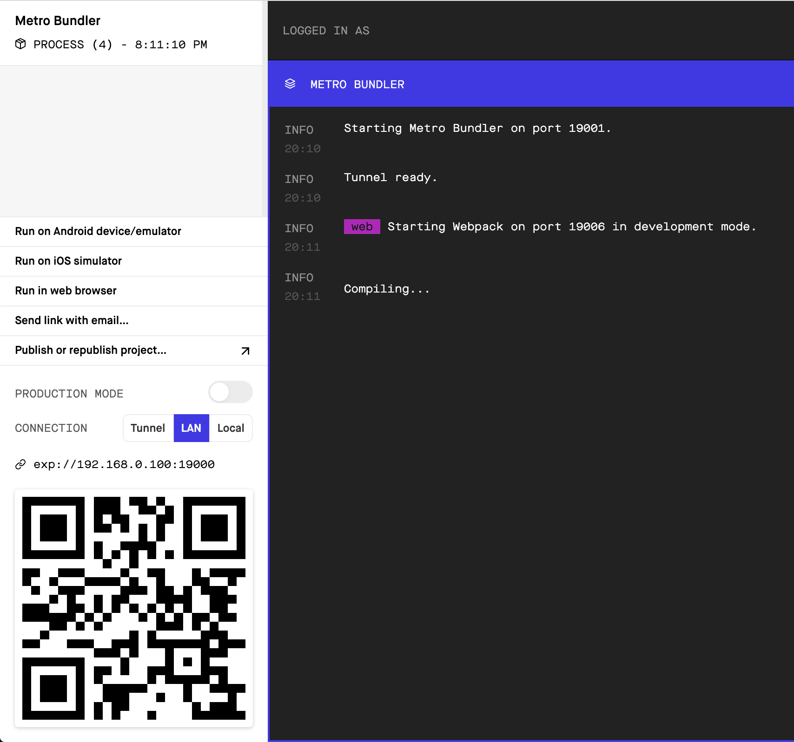
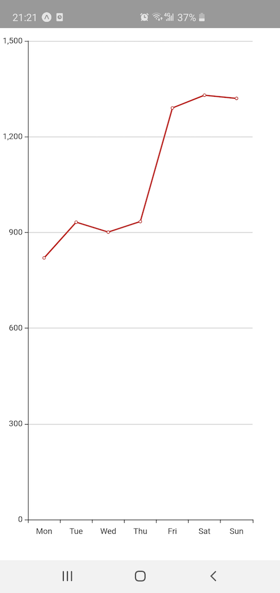
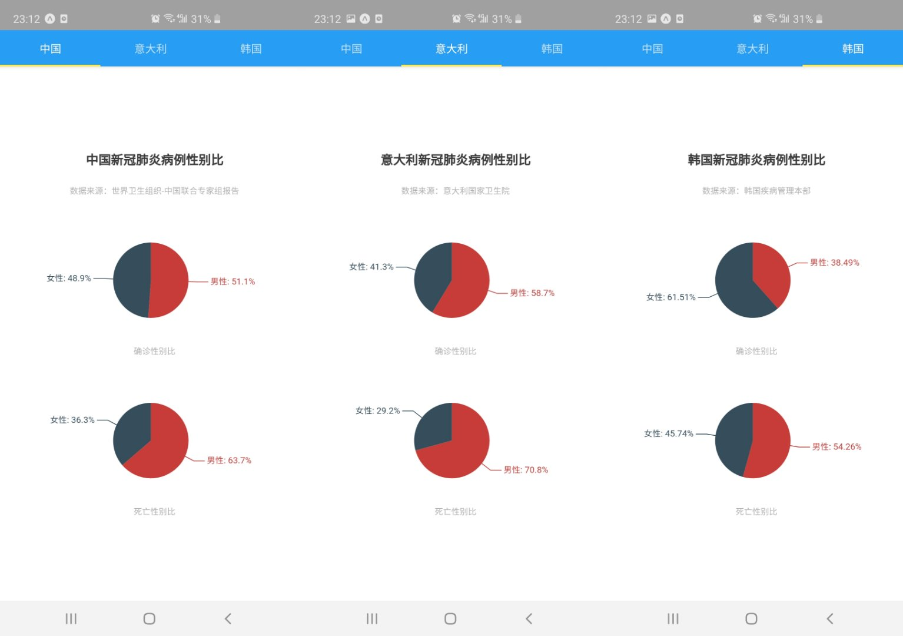

# 可视化任务指南

### 基础配置

首先下载 npm，地址：https://nodejs.org/en/download/

```shell
# 安装 expo
npm install --global expo-cli

# 创建新项目
expo init se-example
# 模板选择 blank 空白模板即可
```

流程完毕后，进入 se-example 文件夹，并执行 `npm start`。

运行成功后，页面左下角会出现二维码，可以使用手机 expo 客户端扫码。手机 expo 客户端下载链接为 https://expo.io/tools#client。

在手机上运行 expo 客户端后，将手机于开发机连入同一局域网，扫描左下角的二维码即可运行 app。



### 运行可视化图表范例

建议使用 `yarn` 作为包管理工具，安装方式见 https://classic.yarnpkg.com/en/docs/install。

在项目文件夹中运行 `yarn add react-native-echarts-wrapper`，安装 `echarts`。

如果没有安装 `react-native-webview` 也需要用 `yarn add react-native-webview` 安装。

安装成功后，将 `App.js` 文件内容替换如下：

```javascript
import React from 'react';
import { ECharts } from "react-native-echarts-wrapper";

export default function App() {
  const option = {
    xAxis: {
      type: "category",
      data: ["Mon", "Tue", "Wed", "Thu", "Fri", "Sat", "Sun"]
    },
    yAxis: {
      type: "value"
    },
    series: [
      {
        data: [820, 932, 901, 934, 1290, 1330, 1320],
        type: "line"
      }
    ]
  };

  return (
      <ECharts
          option={option}
          backgroundColor="white"
      />
  );
}


```

运行 `npm start` 后，在手机上打开效果如下：



### 完成你的可视化任务

查询 ECharts 语法：https://echarts.apache.org/en/option.html

根据 ECharts 语法产生自己的可视化图即可。注意：文档里面提到的参数通常很多很多，建议同学直接在它给的例图的右下角，点“编辑示例”，模仿着改代码，会比较容易些。

这个 repo 现有代码的效果如下图所示：



### 常见问题

有问题直接在群里说吧～

#### 1. 可不可以用浏览器调试？

不能。目前 expo 的浏览器调试功能还在实验阶段，很多包会有问题。

#### 2. Mac 用户出现 `gyp: No Xcode or CLT version detected!` 错误

请移步 https://medium.com/flawless-app-stories/gyp-no-xcode-or-clt-version-detected-macos-catalina-anansewaa-38b536389e8d 查看解决方法。

#### 3. 更改代码后，手机不刷新？

对安卓用户来说，把系统通知栏划下来，可以看到一个刷新的按钮。

对安卓和苹果用户，都可以摇一摇你的手机，会出现 debug 菜单，选择 reload 即可。

如果实在不行，在终端里结束进程，重新 `npm start`。

#### 4. 我看到还有一个叫 `native-echarts` 的包，为啥不用它？

因为它太久没人维护了，最新版的 React Native 会出现 webview 相关的错误。